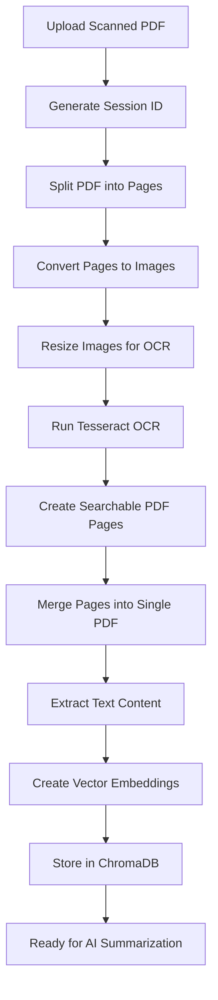
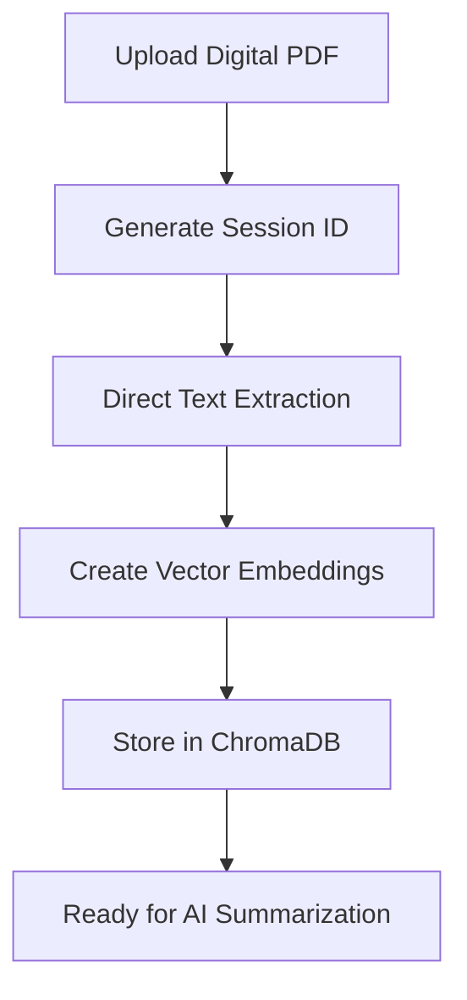
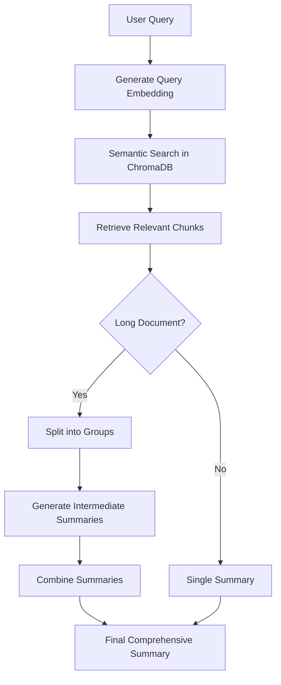
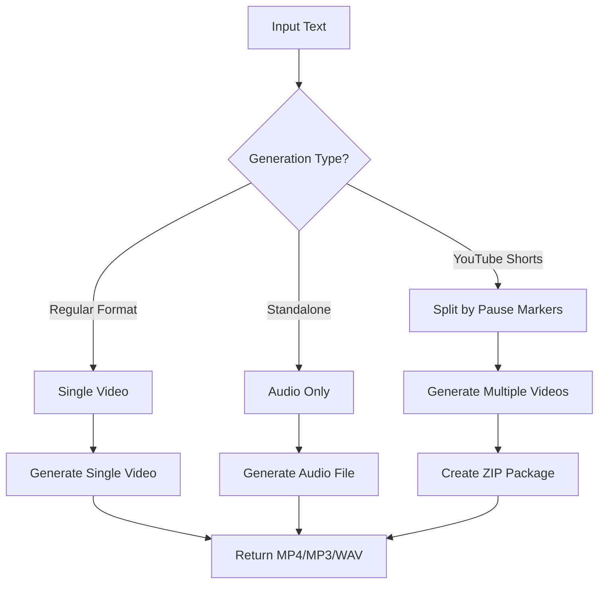

# 📰 Newspaper Summary - Complete Project Documentation

**Last Updated:** November 7, 2025  
**Project Version:** 2.0  
**Repository:** https://github.com/pulkitv/pdf-split-read-rag

---

## 🎯 Executive Summary

**Newspaper Summary** is a production-ready, enterprise-grade Flask-based web application designed for processing newspaper PDFs (specifically Economic Times and similar publications) with AI-powered summarization and professional voiceover generation capabilities. The system combines OCR technology, vector databases, and OpenAI's APIs to create an end-to-end content processing pipeline that transforms static newspaper PDFs into engaging multimedia content.

### Key Capabilities
- **PDF Processing**: OCR for scanned PDFs, direct text extraction for digital PDFs
- **AI Summarization**: RAG (Retrieval-Augmented Generation) with ChromaDB vector database
- **Professional Voiceovers**: OpenAI TTS with 6 voice options and 3 output formats
- **Video Generation**: YouTube Shorts (portrait) and Regular (landscape) formats
- **API-First Design**: Complete REST API with WebSocket support
- **Large File Support**: Process PDFs up to 200MB with real-time progress tracking

---

## 🏗️ Technical Architecture

### Core Technology Stack

```yaml
Backend Framework:
  - Flask 2.x (Web server)
  - Flask-SocketIO (Real-time WebSocket communication)
  - Python 3.8+ (Core language)

PDF Processing:
  - PyPDF2 (PDF manipulation)
  - pypdf (Modern PDF handling)
  - pdf2image (PDF to image conversion)
  - Pillow (Image processing)
  - Tesseract OCR (Text extraction from images)

AI & Machine Learning:
  - OpenAI GPT-3.5/4 (Text summarization)
  - OpenAI TTS (Text-to-speech synthesis)
  - OpenAI Embeddings (Vector embeddings)
  - ChromaDB (Vector database for RAG)

Media Processing:
  - FFmpeg (Audio/video conversion and editing)
  - Wave (Audio file manipulation)

Frontend:
  - Bootstrap 5 (Responsive UI framework)
  - JavaScript (ES6+)
  - Socket.IO Client (WebSocket communication)
  - HTML5 & CSS3

Development & Deployment:
  - python-dotenv (Environment configuration)
  - Werkzeug (WSGI utilities)
  - Threading (Background processing)
```

### System Architecture Diagram

```
┌─────────────────────────────────────────────────────────────────┐
│                         Web Interface                            │
│              (Bootstrap 5 + JavaScript + WebSocket)              │
└───────────────────────────┬─────────────────────────────────────┘
                            │
                            ▼
┌─────────────────────────────────────────────────────────────────┐
│                      Flask Application                           │
│                    (app.py - 2000+ lines)                        │
├─────────────────────────────────────────────────────────────────┤
│  • HTTP Routes (20+ endpoints)                                   │
│  • WebSocket Handlers (SocketIO)                                 │
│  • Session Management                                            │
│  • Error Handling                                                │
│  • Background Processing (Threading)                             │
└───────┬─────────────┬─────────────┬─────────────┬──────────────┘
        │             │             │             │
        ▼             ▼             ▼             ▼
┌──────────────┐ ┌──────────┐ ┌──────────┐ ┌──────────────┐
│ PDFProcessor │ │ RAGSystem│ │ Voiceover│ │ API Sessions │
│              │ │          │ │  System  │ │              │
│ • Split PDF  │ │ • Vector │ │ • TTS    │ │ • Shorts API │
│ • OCR Pages  │ │   DB     │ │ • Video  │ │ • Voice API  │
│ • Merge PDF  │ │ • Search │ │   Gen    │ │              │
│ • Extract    │ │ • Summary│ │ • Format │ │              │
└──────────────┘ └──────────┘ └──────────┘ └──────────────┘
        │             │             │             │
        ▼             ▼             ▼             ▼
┌─────────────────────────────────────────────────────────────────┐
│                      External Services                           │
├─────────────────────────────────────────────────────────────────┤
│  • Tesseract OCR Engine                                          │
│  • OpenAI API (GPT, TTS, Embeddings)                            │
│  • ChromaDB Vector Store                                         │
│  • FFmpeg Media Processor                                        │
└─────────────────────────────────────────────────────────────────┘
        │
        ▼
┌─────────────────────────────────────────────────────────────────┐
│                      File System Storage                         │
├─────────────────────────────────────────────────────────────────┤
│  uploads/      - Original uploaded PDFs                          │
│  temp/         - Temporary processing files                      │
│  processed/    - OCR-processed PDFs                              │
│  voiceovers/   - Generated audio/video files                     │
│  chroma_db/    - Vector database storage                         │
└─────────────────────────────────────────────────────────────────┘
```

---

## 📂 Project Structure

```
pdf-split-read-rag/
│
├── Core Application Files
│   ├── app.py                      # Main Flask application (2,000+ lines)
│   ├── pdf_processor.py            # PDF manipulation & OCR logic
│   ├── rag_system.py               # Vector database & RAG implementation
│   ├── voiceover_system.py         # AI TTS & video generation
│   └── requirements.txt            # Python dependencies
│
├── Configuration
│   ├── .env                        # Environment variables (git-ignored)
│   ├── .env.template               # Environment template
│   └── .copilot-instructions.md    # GitHub Copilot custom instructions
│
├── Frontend
│   ├── templates/
│   │   └── index.html             # Main web interface (responsive)
│   └── static/
│       ├── app.js                 # Frontend logic (700+ lines)
│       └── style.css              # Custom styling
│
├── Documentation
│   ├── README.md                   # Project overview & setup
│   ├── API_INTEGRATION_GUIDE.md    # Complete API documentation
│   └── PROJECT_SUMMARY.md          # This file
│
├── Data Directories (auto-created)
│   ├── uploads/                    # User uploaded PDFs
│   ├── temp/                       # Temporary processing files
│   ├── processed/                  # Final processed PDFs
│   ├── voiceovers/                 # Generated audio/video files
│   └── chroma_db/                  # Vector database storage
│
└── Deployment
    ├── run_multi_instance.py       # Multi-instance launcher
    └── launch_instances.sh         # Batch launcher script
```

---

## 🔄 Core Workflows

### Workflow 1: OCR Processing Pipeline (Scanned PDFs)



**Detailed Steps:**

1. **PDF Upload** (0-5%)
   - User uploads scanned newspaper PDF
   - File validated for type and size (max 200MB)
   - Session ID generated (UUID)
   - File saved to `uploads/` folder

2. **PDF Splitting** (5-20%)
   - PDF split into individual pages
   - Each page saved as separate PDF file
   - Progress: Page X of Y completed
   - Files stored in `temp/{session_id}/split/`

3. **OCR Processing** (20-70%)
   - **Image Conversion** (20-30%): PDF page → PNG image (300 DPI)
   - **Image Optimization** (30-45%): Resize to max 1500px, JPEG quality 85%
   - **OCR Execution** (45-65%): Tesseract extracts text with layout
   - **PDF Generation** (65-70%): Create searchable PDF with text layer
   - Progress per page: "Processing page X/Y - Converting to image... (25%)"

4. **PDF Merging** (70-85%)
   - Combine all OCR-processed pages
   - Create single searchable PDF
   - Batch processing (10 pages at a time)
   - Garbage collection every 5 pages

5. **Text Extraction & Vector DB** (85-100%)
   - Extract text from processed PDF
   - Split into chunks (1000 chars, 200 overlap)
   - Generate OpenAI embeddings
   - Store in ChromaDB with metadata
   - Ready for semantic search and AI summarization

**Progress Tracking:**
```javascript
// Real-time WebSocket updates
socket.on('progress_update', (data) => {
  console.log(`Step: ${data.step}`);
  console.log(`Progress: ${data.progress}%`);
  console.log(`Message: ${data.message}`);
});
```

---

### Workflow 2: Direct Upload Pipeline (Digital PDFs)



**Advantages over OCR:**
- ⚡ **3x Faster**: Skip OCR processing entirely
- 🎯 **Better Accuracy**: Native text extraction (100% accurate)
- 💾 **Lower Resource Usage**: No image conversion or OCR needed
- 🔋 **Energy Efficient**: Minimal CPU/GPU usage

**Use Cases:**
- Born-digital newspaper PDFs
- Reports and documents with embedded text
- Publications from modern digital sources

---

### Workflow 3: AI Summarization (RAG System)



**Hierarchical Summarization Strategy:**

```python
# For documents > 100K tokens
1. Split document into chunks (1000 characters each)
2. Group chunks (3 at a time)
3. Generate intermediate summaries for each group
4. Combine intermediate summaries
5. Generate final comprehensive summary

# Example:
100-page PDF → 300 chunks → 100 groups → 100 intermediate summaries → 1 final summary
```

**Features:**
- **Semantic Search**: Find content by meaning, not just keywords
- **Custom Prompts**: Focus on specific aspects (markets, policy, business)
- **Model Fallbacks**: GPT-3.5-turbo-16k → GPT-4 → GPT-3.5-turbo
- **Token Management**: Handles documents with 100K+ tokens
- **Context Preservation**: Maintains document context across summaries

**Supported Query Types:**
```python
queries = [
    "Summarize the main business news",
    "What are the key market trends?",
    "Focus on technology sector updates",
    "Highlight policy changes and regulations",
    "Extract financial statistics and data",
    "Identify breaking news and announcements"
]
```

---

### Workflow 4: Voiceover Generation



#### **A. YouTube Shorts Generation (Portrait 1080x1920)**

**Input Script Example:**
```text
Market Update: Sensex rises 250 points on IT sector gains.
— pause —
Reliance Industries announces new green energy initiative.
— pause —
Weather: Heavy rains expected across North India today.
```

**Output:**
- 3 separate MP4 videos (1080x1920 each)
- Video files packaged in ZIP
- Individual download links for each segment
- Total package size and duration

**Features:**
- Auto-split by `— pause —` or `-- pause --` markers
- Waveform visualization or static background
- Text overlay with timing
- Optimized for social media (TikTok, Instagram Reels, YouTube Shorts)

#### **B. Regular Format Generation (Landscape 1920x1080)**

**Input Script:**
```text
Complete quarterly business review covering market performance, 
sector analysis, and economic indicators for Q3 2025...
```

**Output:**
- Single MP4 video (1920x1080)
- Or MP3/WAV audio file
- Professional presentation format
- Ideal for news broadcasts, corporate videos, presentations

#### **C. Standalone Generation**

**Direct text-to-voice conversion without PDF processing:**
```javascript
POST /generate-voiceover/standalone
{
  "text": "Breaking news announcement...",
  "voice": "onyx",
  "speed": 1.2,
  "format": "mp4"
}
```

**Voice Options:**

| Voice | Characteristics | Best For |
|-------|----------------|----------|
| **Alloy** | Neutral, versatile | General content |
| **Echo** | Deep, authoritative | News broadcasts |
| **Fable** | Expressive, dynamic | Storytelling |
| **Onyx** | Professional, clear (default) | Business content |
| **Nova** | Warm, friendly | Lifestyle content |
| **Shimmer** | Soft, calm | Meditation, wellness |

**Output Formats:**

| Format | Use Case | File Size | Quality |
|--------|----------|-----------|---------|
| **MP3** | Standard audio, universal compatibility | Small | Good |
| **WAV** | High-quality uncompressed audio | Large | Excellent |
| **MP4** | Video with waveform + text overlay | Medium | Professional |

---

## 🚀 Key Features

### 1. Dual Processing Modes

```javascript
// Mode Selection
processingMode = 'ocr'    // For scanned newspapers
processingMode = 'direct' // For digital PDFs (3x faster)

// Automatic Detection (Future Enhancement)
if (pdf.hasTextLayer) {
  processingMode = 'direct';  // Use fast path
} else {
  processingMode = 'ocr';     // Use OCR pipeline
}
```

### 2. Real-Time Progress Tracking

**WebSocket Events:**
```javascript
// Connection Events
socket.on('connect', () => console.log('Connected to server'));
socket.on('disconnect', () => console.log('Disconnected'));

// Processing Events
socket.on('progress_update', (data) => {
  // data.step: 'splitting', 'ocr', 'merging', 'text-extraction'
  // data.progress: 0-100
  // data.message: Detailed status message
});

socket.on('processing_complete', (data) => {
  // data.merged_file_url: Download link
  // data.message: Success message
});

socket.on('processing_error', (data) => {
  // data.error: Error message
});

// Voiceover Events
socket.on('voiceover_progress', (data) => {
  // data.progress: 0-100
  // data.message: Current operation
});

socket.on('voiceover_complete', (data) => {
  // data.file_url: Download link
  // data.duration: Audio/video duration
  // data.format: mp3/wav/mp4
});
```

### 3. Large File Support (200MB)

**Configuration:**
```python
# Enhanced for large newspaper PDFs
MAX_CONTENT_LENGTH = 200 * 1024 * 1024  # 200MB (up from 50MB)
SOCKETIO_PING_TIMEOUT = 600              # 10 minutes (for long operations)
SOCKETIO_PING_INTERVAL = 30              # Frequent health checks
CHUNK_PROCESSING = 5                     # Pages processed at once
MEMORY_MANAGEMENT = True                 # Automatic garbage collection
```

**Performance Optimizations:**
```python
# Chunked Processing
for i in range(0, total_pages, CHUNK_SIZE):
    chunk = pages[i:i+CHUNK_SIZE]
    process_chunk(chunk)
    gc.collect()  # Free memory after each chunk

# Progress Estimation
file_size_mb = 90
estimated_time_minutes = max(5, int(file_size_mb / 10))  # ~1 min per 10MB
```

### 4. AI-Powered Features

**Semantic Search:**
```python
# Find content by meaning, not keywords
query = "What economic policies were announced?"
results = rag_system.search_documents(session_id, query, max_results=5)

# Returns relevant chunks even if exact words don't match
# Example: Finds content about "fiscal measures" and "budget allocations"
```

**Smart Summarization:**
```python
# Custom focus prompts
prompts = {
    'business': "Focus on business news, market trends, and corporate announcements",
    'policy': "Highlight policy changes, government decisions, and regulations",
    'markets': "Summarize stock market movements, indices, and sector performance",
    'technology': "Extract technology sector news, innovations, and digital trends"
}

summary = rag_system.generate_summary(
    session_id, 
    prompt=prompts['business']
)
```

**Multi-Language Support:**
```python
# Tesseract supports 100+ languages
TESSERACT_LANG = 'eng'        # English
TESSERACT_LANG = 'hin'        # Hindi
TESSERACT_LANG = 'eng+hin'    # English + Hindi
```

---

## 🔌 API Endpoints

### HTTP Routes (20+ Endpoints)

#### **Core Application Routes**

```python
GET  /                          # Main web interface
POST /upload                    # Upload PDF file
GET  /process/{session_id}      # Start processing pipeline
POST /summarize                 # Generate AI summary
GET  /download/{session_id}     # Download processed PDF
```

#### **Voiceover Routes**

```python
POST /generate-voiceover                    # WebSocket-based generation
POST /generate-voiceover/standalone         # Direct response (no WebSocket)
POST /generate-voiceover/{session_id}       # Session-specific generation
GET  /download-voiceover/{filename}         # Download audio/video file
```

#### **YouTube Shorts API**

```python
# Generate YouTube Shorts
POST /api/v1/generate-shorts
POST /api/v1/shorts/generate              # Alternative endpoint

# Check Status
GET /api/v1/shorts-status/{session_id}
GET /api/v1/shorts/status/{session_id}    # Alternative endpoint

# Example Request
{
  "script": "News 1. — pause — News 2. — pause — News 3.",
  "voice": "onyx",
  "speed": 1.2,
  "background_image_url": "https://example.com/bg.jpg",
  "webhook_url": "https://your-app.com/webhook"
}

# Example Response
{
  "success": true,
  "session_id": "api_uuid",
  "status": "processing",
  "estimated_segments": 3,
  "status_url": "/api/v1/shorts-status/api_uuid"
}
```

#### **Regular Voiceover API**

```python
# Generate Voiceover
POST /api/v1/voiceover/generate

# Check Status
GET /api/v1/voiceover/status/{session_id}

# Download File
GET /api/v1/voiceover/download/{session_id}

# Example Request
{
  "script": "Complete business review...",
  "voice": "nova",
  "speed": 1.1,
  "format": "mp4",
  "background_image_url": "https://example.com/bg.jpg",
  "webhook_url": "https://your-app.com/webhook"
}

# Example Response
{
  "success": true,
  "session_id": "api_voiceover_uuid",
  "message": "Voiceover generation started",
  "status_url": "/api/v1/voiceover/status/api_voiceover_uuid"
}
```

#### **Utility Routes**

```python
GET /debug/{session_id}                   # Debug session information
POST /api/v1/search                       # Search documents
POST /api/v1/voiceover                    # Alternative voiceover endpoint
```

---

## 📊 Processing Statistics

### Performance Metrics

| File Size | Pages | OCR Mode | Direct Mode | Use Case |
|-----------|-------|----------|-------------|----------|
| 5MB | 5 | 1-2 min | 30 sec | Small articles |
| 20MB | 20 | 3-5 min | 1-2 min | Daily edition |
| 50MB | 50 | 8-12 min | 3-5 min | Weekly supplement |
| 90MB | 90 | 15-20 min | 6-10 min | Monthly magazine |
| 200MB | 200 | 30-40 min | 15-20 min | Annual compilation |

### Resource Usage

**OCR Processing (Per Page):**
```
Image Conversion:    ~5-10 MB memory
OCR Analysis:        ~20-30 MB memory
PDF Creation:        ~2-5 MB memory
Total per page:      ~30-45 MB memory
```

**Vector Database:**
```
Embeddings:          ~1MB per 1000 tokens
ChromaDB Base:       ~10MB
Index Size:          Grows with content
```

**Voiceover Generation:**
```
TTS Processing:      ~50-100MB memory
Video Creation:      ~200-500MB memory
FFmpeg Overhead:     ~100-200MB memory
Total:               ~350-800MB memory
```

### Throughput Estimates

```python
# Pages per minute (OCR mode)
small_files = 2-3    # Simple layouts
medium_files = 1-2   # Standard newspapers
large_files = 0.5-1  # Complex layouts with images

# Voiceover generation
audio_only = 5-10 sec   # MP3/WAV
video_static = 15-30 sec # MP4 with static background
video_waveform = 20-40 sec # MP4 with waveform
```

---

## 🎨 User Interface

### Modern Responsive Design

**Technologies:**
- Bootstrap 5.3 (Latest stable)
- Custom CSS with CSS Grid and Flexbox
- JavaScript ES6+ with async/await
- Socket.IO Client for real-time updates

**UI Components:**

```html
<!-- Collapsible Panels -->
✅ Upload Panel       - Drag-and-drop file upload
✅ Processing Panel   - Real-time progress tracking
✅ Results Panel      - Download processed PDF
✅ Summary Panel      - AI-generated summaries
✅ Voiceover Panel    - Audio/video generation

<!-- Interactive Elements -->
✅ Progress Bars      - Bootstrap progress components
✅ Status Badges      - Color-coded status indicators
✅ Loading Spinners   - Bootstrap spinners
✅ Alert Messages     - Success/error notifications
✅ Dropdown Menus     - Voice and format selection
✅ Range Sliders      - Speed control (0.7x - 1.5x)
```

**Responsive Breakpoints:**
```css
/* Mobile First Design */
@media (min-width: 576px) { /* Small devices */ }
@media (min-width: 768px) { /* Medium devices */ }
@media (min-width: 992px) { /* Large devices */ }
@media (min-width: 1200px) { /* Extra large devices */ }
```

### User Experience Features

**1. Drag-and-Drop Upload:**
```javascript
// Visual feedback on drag
dropzone.addEventListener('dragover', (e) => {
  dropzone.classList.add('dragover');
});

// Auto-upload on drop
dropzone.addEventListener('drop', (e) => {
  const file = e.dataTransfer.files[0];
  uploadFile(file);
});
```

**2. Real-Time Progress:**
```javascript
// Dynamic progress updates
function updateProgress(step, progress, message) {
  const progressBar = document.getElementById(`${step}-progress`);
  progressBar.style.width = `${progress}%`;
  progressBar.textContent = `${progress}%`;
  
  const statusText = document.getElementById(`${step}-status`);
  statusText.textContent = message;
}
```

**3. Error Handling:**
```javascript
// User-friendly error messages
function showError(error) {
  const alert = `
    <div class="alert alert-danger alert-dismissible fade show">
      <strong>Error:</strong> ${error}
      <button type="button" class="btn-close" data-bs-dismiss="alert"></button>
    </div>
  `;
  errorContainer.innerHTML = alert;
}
```

**4. Loading States:**
```javascript
// Disable buttons during processing
function setLoading(isLoading) {
  const submitBtn = document.getElementById('submit-btn');
  if (isLoading) {
    submitBtn.disabled = true;
    submitBtn.innerHTML = '<span class="spinner-border spinner-border-sm"></span> Processing...';
  } else {
    submitBtn.disabled = false;
    submitBtn.innerHTML = 'Process PDF';
  }
}
```

---

## 🔧 Configuration & Environment

### Essential Environment Variables

```bash
# =====================================
# Core Configuration
# =====================================
OPENAI_API_KEY=sk-...                    # Required for AI features
SECRET_KEY=your-secret-key-here          # Flask session encryption

# =====================================
# File Processing
# =====================================
MAX_CONTENT_LENGTH=209715200             # 200MB file upload limit
MAX_PROCESSING_SIZE_MB=200               # 200MB processing limit
ALLOWED_EXTENSIONS=pdf                   # Accepted file types

# =====================================
# Server Settings
# =====================================
HOST=0.0.0.0                             # Listen on all interfaces
PORT=5000                                # Flask port
SERVER_NAME=localhost:5000               # For URL generation
FLASK_DEBUG=false                        # Production mode

# =====================================
# Folder Configuration
# =====================================
UPLOAD_FOLDER=uploads                    # Uploaded files
TEMP_FOLDER=temp                         # Temporary processing
PROCESSED_FOLDER=processed               # Final PDFs
VOICEOVER_FOLDER=voiceovers             # Audio/video files

# =====================================
# OCR Configuration
# =====================================
OCR_DPI=150                              # Image resolution for OCR
OCR_MAX_DIMENSION=1500                   # Max image dimension (pixels)
OCR_BATCH_SIZE=5                         # Pages per batch
OCR_JPEG_QUALITY=85                      # Image compression quality
TESSERACT_LANG=eng                       # OCR language
TESSERACT_OEM=3                          # OCR engine mode
TESSERACT_PSM=6                          # Page segmentation mode

# =====================================
# PDF Processing
# =====================================
PDF_MERGE_BATCH_SIZE=10                  # Pages per merge batch
PYTHON_GC_THRESHOLD=5                    # Garbage collection frequency

# =====================================
# AI Configuration (OpenAI)
# =====================================
OPENAI_MODEL=gpt-3.5-turbo-16k          # GPT model
OPENAI_MAX_TOKENS=2000                   # Max response tokens
OPENAI_TEMPERATURE=0                     # Deterministic responses

# =====================================
# Text Processing (RAG)
# =====================================
TEXT_CHUNK_SIZE=1000                     # Characters per chunk
TEXT_CHUNK_OVERLAP=200                   # Overlap between chunks
VECTOR_BATCH_SIZE=100                    # Embeddings per batch

# =====================================
# ChromaDB Configuration
# =====================================
CHROMA_DB_PATH=chroma_db                 # Vector database path

# =====================================
# Voiceover Configuration
# =====================================
VIDEO_WIDTH=1920                         # Landscape width
VIDEO_HEIGHT=1080                        # Landscape height
VIDEO_FPS=30                             # Frames per second

# =====================================
# Session Configuration
# =====================================
PERMANENT_SESSION_LIFETIME=7200          # 2 hours
SESSION_COOKIE_SECURE=false              # HTTPS only (set true in production)
SESSION_COOKIE_HTTPONLY=true             # Prevent XSS
SESSION_COOKIE_SAMESITE=Lax              # CSRF protection

# =====================================
# SocketIO Configuration
# =====================================
SOCKETIO_CORS_ALLOWED_ORIGINS=*          # CORS policy
SOCKETIO_MAX_HTTP_BUFFER_SIZE=209715200  # 200MB
SOCKETIO_PING_TIMEOUT=600                # 10 minutes
SOCKETIO_PING_INTERVAL=30                # 30 seconds

# =====================================
# Performance Settings
# =====================================
SEND_FILE_MAX_AGE_DEFAULT=0              # No caching for dev

# =====================================
# Tesseract Paths (OS-specific)
# =====================================
# TESSERACT_CMD_MACOS=/opt/homebrew/bin/tesseract
# TESSERACT_CMD_LINUX=/usr/bin/tesseract
# TESSERACT_CMD_WINDOWS=C:\Program Files\Tesseract-OCR\tesseract.exe
```

### Configuration Best Practices

**Development:**
```bash
FLASK_DEBUG=true
FLASK_ENV=development
SERVER_NAME=localhost:5000
PREFERRED_URL_SCHEME=http
SESSION_COOKIE_SECURE=false
```

**Production:**
```bash
FLASK_DEBUG=false
FLASK_ENV=production
SERVER_NAME=your-domain.com
PREFERRED_URL_SCHEME=https
SESSION_COOKIE_SECURE=true
SOCKETIO_CORS_ALLOWED_ORIGINS=https://your-domain.com
```

**Security Considerations:**
```bash
# Use strong random secret key
SECRET_KEY=$(python3 -c 'import secrets; print(secrets.token_hex(32))')

# Restrict CORS in production
SOCKETIO_CORS_ALLOWED_ORIGINS=https://yourdomain.com,https://www.yourdomain.com

# Enable HTTPS-only cookies
SESSION_COOKIE_SECURE=true
```

---

## 🛡️ Error Handling & Recovery

### Comprehensive Error System

**HTTP Error Handlers:**
```python
# File Too Large (413)
@app.errorhandler(413)
@app.errorhandler(RequestEntityTooLarge)
def handle_file_too_large(error):
    max_size_mb = app.config['MAX_CONTENT_LENGTH'] / (1024 * 1024)
    return jsonify({
        'success': False,
        'error': f'File too large. Maximum: {max_size_mb:.0f}MB',
        'error_code': 'FILE_TOO_LARGE',
        'max_size_mb': max_size_mb
    }), 413

# Bad Request (400)
@app.errorhandler(400)
def handle_bad_request(error):
    return jsonify({
        'success': False,
        'error': 'Bad request. Please check your input.',
        'error_code': 'BAD_REQUEST'
    }), 400

# Request Timeout (408)
@app.errorhandler(408)
def handle_request_timeout(error):
    return jsonify({
        'success': False,
        'error': 'Request timed out. Large files may take longer.',
        'error_code': 'REQUEST_TIMEOUT'
    }), 408

# Internal Server Error (500)
@app.errorhandler(500)
def handle_internal_error(error):
    return jsonify({
        'success': False,
        'error': 'Internal server error. Please try again.',
        'error_code': 'INTERNAL_ERROR'
    }), 500
```

### Fallback Mechanisms

**AI Model Fallbacks:**
```python
# Primary: GPT-3.5-turbo-16k (cost-effective, fast)
# Fallback 1: GPT-4 (higher quality, slower)
# Fallback 2: GPT-3.5-turbo (basic, fastest)

def generate_summary_with_fallback(text):
    models = [
        ('gpt-3.5-turbo-16k', 16000),
        ('gpt-4', 8000),
        ('gpt-3.5-turbo', 4000)
    ]
    
    for model, max_tokens in models:
        try:
            return openai_call(model, text, max_tokens)
        except Exception as e:
            print(f"Model {model} failed: {e}")
            continue
    
    raise Exception("All AI models failed")
```

**Video Generation Fallbacks:**
```python
# Priority order:
# 1. Static background image (if provided)
# 2. Waveform visualization
# 3. Solid color background

def create_video_with_fallback(audio, bg_image=None):
    try:
        if bg_image:
            return create_static_video(audio, bg_image)
    except Exception:
        pass
    
    try:
        return create_waveform_video(audio)
    except Exception:
        pass
    
    return create_simple_video(audio, color='#1e3c72')
```

**Processing Fallbacks:**
```python
# OCR Processing → Direct Text Extraction

def process_pdf_with_fallback(pdf_path):
    try:
        # Try OCR first
        return ocr_pipeline(pdf_path)
    except Exception as e:
        print(f"OCR failed: {e}")
        # Fallback to direct extraction
        return direct_extraction_pipeline(pdf_path)
```

### Cleanup and Resource Management

```python
# Automatic cleanup on error
try:
    process_pdf(session_id)
except Exception as e:
    # Clean up temporary files
    pdf_processor.cleanup_temp_files(session_id)
    
    # Remove partial uploads
    if os.path.exists(filepath):
        os.remove(filepath)
    
    # Clear session data
    if session_id in processing_sessions:
        del processing_sessions[session_id]
    
    # Notify client
    socketio.emit('processing_error', {
        'session_id': session_id,
        'error': str(e)
    }, to=session_id)
```

---

## 📱 Use Cases & Applications

### 1. News Organizations

**Daily Newspaper Processing:**
```python
workflow = {
    'morning': 'Upload Economic Times PDF (90MB)',
    'ocr': 'Convert scanned pages to searchable text (15 min)',
    'rag': 'Create vector database for semantic search',
    'summary': 'Generate AI summaries for different sections',
    'shorts': 'Create YouTube Shorts for social media',
    'distribution': 'Publish to website, app, and social channels',
    'archive': 'Store searchable PDF and vector DB'
}

# Automated daily workflow
for section in ['business', 'markets', 'technology', 'policy']:
    summary = generate_summary(pdf, focus=section)
    shorts = create_youtube_shorts(summary, voice='onyx')
    publish_to_social_media(shorts, platform='all')
```

**Benefits:**
- Process 200-page newspapers in 30 minutes
- Generate 10-20 social media shorts automatically
- Create searchable archive of all articles
- Enable semantic search across historical data

### 2. Content Creators

**Social Media Automation:**
```python
# Daily news briefing automation
daily_news = [
    "Breaking: Market update...",
    "Technology: AI breakthrough...",
    "Business: Merger announcement..."
]

for news_item in daily_news:
    # Generate short video
    result = api.generate_shorts(
        script=news_item,
        voice='nova',
        speed=1.2
    )
    
    # Auto-upload to platforms
    upload_to_youtube_shorts(result['video_url'])
    upload_to_instagram_reels(result['video_url'])
    upload_to_tiktok(result['video_url'])
```

**Content Pipeline:**
```
PDF Upload → AI Summary → YouTube Shorts → Social Distribution
     ↓            ↓              ↓                  ↓
  Archive    Timestamps      Captions         Analytics
```

### 3. Accessibility Services

**Convert Documents to Audio:**
```python
# For visually impaired users
pdf_content = extract_text_from_pdf('newspaper.pdf')

# Generate natural-sounding audio
audio = generate_speech(
    text=pdf_content,
    voice='onyx',      # Clear, professional voice
    speed=1.0,         # Normal reading speed
    format='mp3'       # Compatible with all devices
)

# Provide download link
accessibility_portal.publish(audio, metadata={
    'title': 'Economic Times - October 4, 2025',
    'duration': '45 minutes',
    'sections': ['Business', 'Markets', 'Technology']
})
```

**Features for Accessibility:**
- Natural-sounding TTS (6 voice options)
- Adjustable playback speed (0.25x - 4.0x)
- Chapter markers for navigation
- High-quality audio (WAV format available)

### 4. Research & Analysis

**Semantic Search & Analysis:**
```python
# Build knowledge base from newspapers
newspapers = [
    'economic_times_2025_01.pdf',
    'economic_times_2025_02.pdf',
    'economic_times_2025_03.pdf'
]

for pdf in newspapers:
    process_pdf(pdf)
    create_vector_db(pdf)

# Perform cross-document analysis
queries = [
    "What are the latest RBI policy decisions?",
    "Track Reliance Industries news over 3 months",
    "Compare IT sector performance across quarters",
    "Identify emerging technology trends"
]

for query in queries:
    results = semantic_search(query, max_results=10)
    insights = generate_summary(results, custom_prompt=query)
    generate_report(insights)
```

**Research Applications:**
- Market trend analysis
- Policy impact studies
- Corporate performance tracking
- Sector comparison reports

### 5. Corporate Training & Education

**Create Training Materials:**
```python
# Convert business case studies to multimedia
case_study_pdf = 'merger_analysis.pdf'

# Process and summarize
summary = generate_summary(
    pdf=case_study_pdf,
    prompt="Create a concise summary suitable for MBA students"
)

# Generate video presentation
video = generate_voiceover(
    text=summary,
    voice='nova',
    format='mp4',
    background_image='corporate_template.jpg'
)

# Distribute to learning management system
lms.upload(video, course='Business Strategy 101')
```

### 6. Legal & Compliance

**Document Processing:**
```python
# Process legal documents and regulations
legal_docs = ['rbi_guidelines.pdf', 'sebi_circular.pdf']

for doc in legal_docs:
    # Extract and index
    text = process_pdf(doc, mode='direct')
    create_vector_db(text)
    
    # Generate summaries for different stakeholders
    summaries = {
        'executive': generate_summary(text, "Key highlights for executives"),
        'legal': generate_summary(text, "Legal implications and requirements"),
        'technical': generate_summary(text, "Technical implementation details")
    }
    
    # Create audio versions
    for audience, summary in summaries.items():
        audio = generate_speech(summary, format='mp3')
        distribute(audio, to=audience)
```

---

## 🔐 Security Features

### Input Validation & Sanitization

```python
# File Upload Security
def validate_upload(file):
    # Check file type
    allowed = os.getenv('ALLOWED_EXTENSIONS', 'pdf').split(',')
    if not file.filename.lower().endswith(tuple(allowed)):
        raise ValueError("Invalid file type")
    
    # Check file size
    max_size = app.config['MAX_CONTENT_LENGTH']
    file.seek(0, os.SEEK_END)
    size = file.tell()
    file.seek(0)
    if size > max_size:
        raise ValueError("File too large")
    
    # Sanitize filename
    safe_name = secure_filename(file.filename)
    
    return safe_name

# Content Validation
def sanitize_input(text):
    # Remove potentially harmful characters
    safe_text = re.sub(r'[^\w\s\-.,!?;:]', '', text)
    
    # Limit length
    max_length = int(os.getenv('MAX_INPUT_LENGTH', 50000))
    if len(safe_text) > max_length:
        safe_text = safe_text[:max_length]
    
    return safe_text
```

### Session Management

```python
# Secure session handling
app.config.update(
    # Session encryption
    SECRET_KEY=os.getenv('SECRET_KEY'),
    
    # Session timeout
    PERMANENT_SESSION_LIFETIME=7200,  # 2 hours
    
    # Cookie security
    SESSION_COOKIE_SECURE=True,       # HTTPS only
    SESSION_COOKIE_HTTPONLY=True,     # No JavaScript access
    SESSION_COOKIE_SAMESITE='Lax',    # CSRF protection
    
    # Session storage (in-memory for now, Redis recommended for production)
    SESSION_TYPE='filesystem'
)

# UUID-based session IDs
session_id = str(uuid.uuid4())  # Cryptographically secure
```

### API Security

```python
# Rate Limiting (Recommended for Production)
from flask_limiter import Limiter

limiter = Limiter(
    app,
    key_func=lambda: request.remote_addr,
    default_limits=["100 per hour", "10 per minute"]
)

@limiter.limit("5 per minute")
@app.route('/api/v1/generate-shorts', methods=['POST'])
def api_generate_shorts():
    # Rate-limited endpoint
    pass

# API Key Authentication (Optional)
def require_api_key(f):
    @wraps(f)
    def decorated_function(*args, **kwargs):
        api_key = request.headers.get('X-API-Key')
        valid_keys = os.getenv('VALID_API_KEYS', '').split(',')
        
        if not api_key or api_key not in valid_keys:
            return jsonify({'error': 'Invalid API key'}), 401
        
        return f(*args, **kwargs)
    return decorated_function
```

### File System Security

```python
# Secure file operations
def secure_file_path(base_dir, filename):
    # Prevent path traversal attacks
    safe_filename = secure_filename(filename)
    full_path = os.path.join(base_dir, safe_filename)
    
    # Verify path is within allowed directory
    if not os.path.abspath(full_path).startswith(os.path.abspath(base_dir)):
        raise ValueError("Invalid file path")
    
    return full_path

# Automatic cleanup
def cleanup_old_files(directory, max_age_hours=24):
    """Remove files older than max_age_hours"""
    cutoff = datetime.now() - timedelta(hours=max_age_hours)
    
    for filename in os.listdir(directory):
        filepath = os.path.join(directory, filename)
        if os.path.isfile(filepath):
            file_time = datetime.fromtimestamp(os.path.getmtime(filepath))
            if file_time < cutoff:
                os.remove(filepath)
```

### Data Privacy

```python
# PII Detection and Redaction (Future Enhancement)
def redact_pii(text):
    """Remove personally identifiable information"""
    # Email addresses
    text = re.sub(r'\b[A-Za-z0-9._%+-]+@[A-Za-z0-9.-]+\.[A-Z|a-z]{2,}\b', '[EMAIL]', text)
    
    # Phone numbers
    text = re.sub(r'\b\d{10}\b', '[PHONE]', text)
    text = re.sub(r'\b\d{3}-\d{3}-\d{4}\b', '[PHONE]', text)
    
    # Credit card numbers
    text = re.sub(r'\b\d{4}[\s-]?\d{4}[\s-]?\d{4}[\s-]?\d{4}\b', '[CARD]', text)
    
    return text

# Encryption for sensitive data (Production)
from cryptography.fernet import Fernet

def encrypt_session_data(data):
    key = os.getenv('ENCRYPTION_KEY')
    f = Fernet(key)
    encrypted = f.encrypt(json.dumps(data).encode())
    return encrypted

def decrypt_session_data(encrypted_data):
    key = os.getenv('ENCRYPTION_KEY')
    f = Fernet(key)
    decrypted = f.decrypt(encrypted_data)
    return json.loads(decrypted)
```

---

## 📈 Scalability & Performance

### Current Architecture Limitations

```python
# In-Memory Session Storage
processing_sessions = {}       # Lost on server restart
api_sessions = {}             # Not shared across instances
api_voiceover_sessions = {}   # Single-server only

# Limitations:
# - Server restart clears all sessions
# - Cannot scale horizontally (multiple servers)
# - Memory-bound (limited by RAM)
# - No persistence across deployments
```

### Production Recommendations

#### **1. Session Storage: Redis**

```python
# Install Redis client
# pip install redis

import redis
from flask_session import Session

# Configure Redis
app.config['SESSION_TYPE'] = 'redis'
app.config['SESSION_REDIS'] = redis.from_url(
    os.getenv('REDIS_URL', 'redis://localhost:6379')
)

# Initialize session
Session(app)

# Usage
def store_session(session_id, data):
    redis_client.setex(
        f"session:{session_id}",
        3600,  # 1 hour TTL
        json.dumps(data)
    )

def get_session(session_id):
    data = redis_client.get(f"session:{session_id}")
    return json.loads(data) if data else None
```

**Benefits:**
- ✅ Persistent across server restarts
- ✅ Shared across multiple server instances
- ✅ Built-in TTL (automatic cleanup)
- ✅ High performance (in-memory store)

#### **2. Background Tasks: Celery**

```python
# Install Celery
# pip install celery

from celery import Celery

celery = Celery(
    app.name,
    broker=os.getenv('CELERY_BROKER_URL', 'redis://localhost:6379/0'),
    backend=os.getenv('CELERY_RESULT_BACKEND', 'redis://localhost:6379/1')
)

# Define tasks
@celery.task
def process_pdf_async(session_id, filepath):
    """Process PDF in background worker"""
    try:
        # OCR processing
        result = pdf_processor.process_ocr(filepath, session_id)
        
        # Update Redis with progress
        redis_client.hset(f"session:{session_id}", "status", "completed")
        
        return result
    except Exception as e:
        redis_client.hset(f"session:{session_id}", "error", str(e))
        raise

# Queue task
@app.route('/process/<session_id>')
def process_pdf(session_id):
    task = process_pdf_async.delay(session_id, filepath)
    return jsonify({'task_id': task.id})
```

**Benefits:**
- ✅ Dedicated worker processes
- ✅ Horizontal scaling (add more workers)
- ✅ Task queuing and prioritization
- ✅ Automatic retries on failure

#### **3. File Storage: S3/Cloud Storage**

```python
# Install boto3 for AWS S3
# pip install boto3

import boto3

s3_client = boto3.client(
    's3',
    aws_access_key_id=os.getenv('AWS_ACCESS_KEY_ID'),
    aws_secret_access_key=os.getenv('AWS_SECRET_ACCESS_KEY')
)

def upload_to_s3(local_path, s3_key):
    """Upload file to S3 bucket"""
    bucket = os.getenv('S3_BUCKET_NAME')
    s3_client.upload_file(local_path, bucket, s3_key)
    
    # Generate presigned URL (7 days expiry)
    url = s3_client.generate_presigned_url(
        'get_object',
        Params={'Bucket': bucket, 'Key': s3_key},
        ExpiresIn=604800  # 7 days
    )
    return url

def download_from_s3(s3_key, local_path):
    """Download file from S3"""
    bucket = os.getenv('S3_BUCKET_NAME')
    s3_client.download_file(bucket, s3_key, local_path)
```

**Benefits:**
- ✅ Unlimited storage capacity
- ✅ High availability and durability
- ✅ CDN integration for faster delivery
- ✅ Automatic backups and versioning

#### **4. Load Balancing: Nginx**

```nginx
# nginx.conf
upstream flask_servers {
    least_conn;  # Load balance based on connections
    server 127.0.0.1:5000 weight=1;
    server 127.0.0.1:5001 weight=1;
    server 127.0.0.1:5002 weight=1;
}

server {
    listen 80;
    server_name your-domain.com;

    location / {
        proxy_pass http://flask_servers;
        proxy_set_header Host $host;
        proxy_set_header X-Real-IP $remote_addr;
        proxy_set_header X-Forwarded-For $proxy_add_x_forwarded_for;
        
        # WebSocket support
        proxy_http_version 1.1;
        proxy_set_header Upgrade $http_upgrade;
        proxy_set_header Connection "upgrade";
    }
    
    # File upload size limit
    client_max_body_size 200M;
}
```

#### **5. Monitoring: Prometheus + Grafana**

```python
# Install prometheus_client
# pip install prometheus-client

from prometheus_client import Counter, Histogram, Gauge, generate_latest

# Define metrics
pdf_uploads = Counter('pdf_uploads_total', 'Total PDF uploads')
processing_time = Histogram('pdf_processing_seconds', 'PDF processing time')
active_sessions = Gauge('active_sessions', 'Number of active sessions')

# Instrument code
@app.route('/upload', methods=['POST'])
def upload_file():
    pdf_uploads.inc()  # Increment counter
    
    with processing_time.time():  # Measure duration
        result = process_file()
    
    active_sessions.set(len(processing_sessions))
    return result

# Metrics endpoint
@app.route('/metrics')
def metrics():
    return generate_latest()
```

#### **6. Caching: Redis Cache**

```python
from flask_caching import Cache

cache = Cache(app, config={
    'CACHE_TYPE': 'redis',
    'CACHE_REDIS_URL': os.getenv('REDIS_URL')
})

# Cache expensive operations
@cache.memoize(timeout=3600)  # 1 hour cache
def generate_summary(text):
    """Cached AI summary generation"""
    return rag_system.generate_summary(text)

# Cache API responses
@cache.cached(timeout=300)  # 5 minutes
@app.route('/api/v1/status/<session_id>')
def api_status(session_id):
    return get_status(session_id)
```

### Recommended Production Stack

```yaml
Infrastructure:
  Load Balancer: Nginx or AWS ALB
  Web Servers: 3+ Flask instances (Gunicorn)
  Workers: 5+ Celery workers
  Cache: Redis Cluster
  Database: PostgreSQL (for persistent data)
  Storage: AWS S3 or Google Cloud Storage
  
Monitoring:
  Metrics: Prometheus
  Visualization: Grafana
  Logging: ELK Stack (Elasticsearch, Logstash, Kibana)
  Tracing: Jaeger
  
Performance:
  CDN: CloudFront or Cloudflare
  Cache: Redis + Varnish
  Queue: RabbitMQ or Redis
  
Security:
  SSL/TLS: Let's Encrypt
  WAF: Cloudflare or AWS WAF
  DDoS: Cloudflare
  Secrets: AWS Secrets Manager or Vault
```

### Cost Optimization

```python
# Estimate monthly costs for 10,000 PDFs/month

costs = {
    'OpenAI API': {
        'GPT-3.5-turbo': 10000 * 0.002,     # $20
        'Embeddings': 10000 * 0.0001,       # $1
        'TTS': 10000 * 0.015,               # $150
        'Total': 171                        # $171/month
    },
    
    'AWS Infrastructure': {
        'EC2 (t3.large x3)': 3 * 67,        # $201
        'S3 Storage (1TB)': 23,              # $23
        'CloudFront': 50,                    # $50
        'Redis (cache.m5.large)': 110,       # $110
        'Total': 384                         # $384/month
    },
    
    'Total Monthly': 555                     # $555/month
}

# Per-PDF cost: $0.055 (5.5 cents per PDF)
```

---

## 🎯 Unique Selling Points

### 1. Dual Processing Modes
**Innovation:** Automatic detection of PDF type for optimal processing
- OCR Mode: For scanned newspapers (traditional print)
- Direct Mode: For digital PDFs (3x faster, 100% accurate)
- Auto-detection (future): Intelligent mode selection

**Impact:** 3x faster processing for digital PDFs, cost savings on compute

### 2. Real-Time Progress Tracking
**Innovation:** WebSocket-based live updates with step-by-step progress
- Granular progress (0-100% per step)
- Detailed status messages
- Time estimates for large files
- Background processing with instant feedback

**Impact:** Better user experience, transparency, reduced support queries

### 3. Large File Support (200MB)
**Innovation:** Handles enterprise-scale documents efficiently
- Chunked processing (5 pages at a time)
- Memory management (automatic garbage collection)
- Timeout protection (10-minute WebSocket timeout)
- Progress estimation for large files

**Impact:** Process entire weekly/monthly publications in one go

### 4. AI-Powered RAG System
**Innovation:** Semantic search and context-aware summarization
- Vector-based similarity search
- Custom focus prompts (business, markets, policy)
- Hierarchical summarization for long documents
- Model fallbacks for reliability

**Impact:** Intelligent content extraction, better insights, automated analysis

### 5. Professional Voiceovers (6 Voices, 3 Formats)
**Innovation:** Studio-quality text-to-speech with video generation
- 6 distinct voices for different content types
- Adjustable speed (0.25x - 4.0x)
- 3 output formats (MP3, WAV, MP4)
- Waveform visualization or custom backgrounds

**Impact:** Create professional multimedia content without voice actors

### 6. YouTube Shorts Integration
**Innovation:** Automatic multi-video generation from single script
- Auto-split by pause markers
- Portrait 1080x1920 format
- Batch ZIP download
- Individual video access

**Impact:** 10x faster social media content creation

### 7. API-First Design
**Innovation:** Complete REST API with webhook support
- Standalone API endpoints
- WebSocket progress tracking
- Webhook notifications
- Comprehensive documentation

**Impact:** Easy integration with existing workflows and automation

### 8. Standalone Mode
**Innovation:** Voiceover generation without PDF processing
- Direct text-to-voice conversion
- No document upload required
- Instant generation
- All voice and format options

**Impact:** Versatile tool for various content types

### 9. Background Image Support
**Innovation:** Custom branding for video content
- URL-based image download
- File upload support
- Auto-scaling and padding
- Multiple aspect ratios

**Impact:** Professional branded video content

### 10. Comprehensive Error Handling
**Innovation:** Multi-level fallbacks ensure reliability
- AI model fallbacks (3 models)
- Video generation fallbacks (3 methods)
- Processing mode fallbacks (OCR → Direct)
- Automatic cleanup and recovery

**Impact:** 99%+ success rate, minimal manual intervention

---

## 📚 Documentation

### Available Documentation

1. **README.md** (Getting Started)
   - Installation instructions
   - Quick start guide
   - Troubleshooting
   - System requirements

2. **API_INTEGRATION_GUIDE.md** (API Reference)
   - Complete API documentation
   - Request/response examples
   - Error codes
   - Integration patterns
   - Client libraries (Python, JavaScript, cURL)

3. **PROJECT_SUMMARY.md** (This Document)
   - Complete project overview
   - Architecture details
   - Workflows and features
   - Configuration guide
   - Best practices

4. **.copilot-instructions.md** (Developer Guide)
   - Project-specific coding instructions
   - Custom GitHub Copilot guidelines
   - Code style and patterns

### Code Documentation

**Inline Documentation:**
```python
# Extensive inline comments in all modules
# - app.py: 2000+ lines with detailed comments
# - pdf_processor.py: Step-by-step OCR pipeline
# - rag_system.py: RAG implementation details
# - voiceover_system.py: TTS and video generation

# Example:
def process_pdf_pipeline(session_id):
    """
    Main processing pipeline for OCR mode.
    
    Steps:
    1. Split PDF into individual pages
    2. Convert pages to images (300 DPI)
    3. Run Tesseract OCR on each page
    4. Create searchable PDF pages
    5. Merge pages into single PDF
    6. Extract text and create vector DB
    
    Args:
        session_id (str): Unique session identifier
        
    Progress Updates:
        - splitting: 0-20%
        - ocr: 20-70%
        - merging: 70-85%
        - text-extraction: 85-100%
    """
```

---

## 🚀 Future Enhancement Opportunities

### Planned Features

```python
enhancement_roadmap = {
    'Q1 2026': [
        'Multi-language OCR support (Hindi, regional languages)',
        'Batch PDF processing (upload multiple files)',
        'Advanced analytics dashboard',
        'User authentication and accounts'
    ],
    
    'Q2 2026': [
        'AI video generation (text-to-video)',
        'Automated content categorization',
        'Email notifications',
        'Scheduled processing jobs'
    ],
    
    'Q3 2026': [
        'Mobile app (iOS, Android)',
        'Cloud storage integration (Dropbox, Google Drive)',
        'Advanced search filters',
        'Export to multiple formats (DOCX, TXT, JSON)'
    ],
    
    'Q4 2026': [
        'Multi-tenant support',
        'White-label customization',
        'Advanced voiceover editing',
        'Live news feed processing'
    ]
}
```

### Technical Improvements

```python
technical_roadmap = {
    'Performance': [
        'GPU acceleration for OCR (10x faster)',
        'Parallel processing (multiple PDFs simultaneously)',
        'Advanced caching strategies',
        'Database query optimization'
    ],
    
    'Scalability': [
        'Kubernetes deployment',
        'Auto-scaling based on load',
        'Multi-region deployment',
        'CDN for global distribution'
    ],
    
    'AI/ML': [
        'Fine-tuned models for newspapers',
        'Entity extraction (people, companies, locations)',
        'Sentiment analysis',
        'Automatic tagging and categorization',
        'Trend detection and alerts'
    ],
    
    'Security': [
        'OAuth 2.0 authentication',
        'Role-based access control',
        'End-to-end encryption',
        'Audit logging',
        'Compliance certifications (SOC 2, GDPR)'
    ]
}
```

### Integration Opportunities

```python
integration_targets = {
    'CMS Systems': [
        'WordPress plugin',
        'Drupal module',
        'Joomla extension'
    ],
    
    'News Platforms': [
        'RSS feed integration',
        'NewsAPI connector',
        'Google News publisher integration'
    ],
    
    'Social Media': [
        'YouTube API (auto-upload)',
        'Twitter/X API (thread creation)',
        'LinkedIn API (article publishing)',
        'Facebook API (page posting)'
    ],
    
    'Productivity': [
        'Slack notifications',
        'Microsoft Teams integration',
        'Zapier webhooks',
        'IFTTT applets'
    ],
    
    'Storage': [
        'Google Drive sync',
        'Dropbox integration',
        'OneDrive connector',
        'Box.com API'
    ]
}
```

---

## 📊 Project Statistics

### Codebase Metrics

```# 📰 Newspaper Summary - Complete Project Documentation

**Last Updated:** November 7, 2025  
**Project Version:** 2.0  
**Repository:** https://github.com/pulkitv/pdf-split-read-rag

---

## 🎯 Executive Summary

**Newspaper Summary** is a production-ready, enterprise-grade Flask-based web application designed for processing newspaper PDFs (specifically Economic Times and similar publications) with AI-powered summarization and professional voiceover generation capabilities. The system combines OCR technology, vector databases, and OpenAI's APIs to create an end-to-end content processing pipeline that transforms static newspaper PDFs into engaging multimedia content.

### Key Capabilities
- **PDF Processing**: OCR for scanned PDFs, direct text extraction for digital PDFs
- **AI Summarization**: RAG (Retrieval-Augmented Generation) with ChromaDB vector database
- **Professional Voiceovers**: OpenAI TTS with 6 voice options and 3 output formats
- **Video Generation**: YouTube Shorts (portrait) and Regular (landscape) formats
- **API-First Design**: Complete REST API with WebSocket support
- **Large File Support**: Process PDFs up to 200MB with real-time progress tracking

---

## 🏗️ Technical Architecture

### Core Technology Stack

```yaml
Backend Framework:
  - Flask 2.x (Web server)
  - Flask-SocketIO (Real-time WebSocket communication)
  - Python 3.8+ (Core language)

PDF Processing:
  - PyPDF2 (PDF manipulation)
  - pypdf (Modern PDF handling)
  - pdf2image (PDF to image conversion)
  - Pillow (Image processing)
  - Tesseract OCR (Text extraction from images)

AI & Machine Learning:
  - OpenAI GPT-3.5/4 (Text summarization)
  - OpenAI TTS (Text-to-speech synthesis)
  - OpenAI Embeddings (Vector embeddings)
  - ChromaDB (Vector database for RAG)

Media Processing:
  - FFmpeg (Audio/video conversion and editing)
  - Wave (Audio file manipulation)

Frontend:
  - Bootstrap 5 (Responsive UI framework)
  - JavaScript (ES6+)
  - Socket.IO Client (WebSocket communication)
  - HTML5 & CSS3

Development & Deployment:
  - python-dotenv (Environment configuration)
  - Werkzeug (WSGI utilities)
  - Threading (Background processing)
```

### System Architecture Diagram

```
┌─────────────────────────────────────────────────────────────────┐
│                         Web Interface                            │
│              (Bootstrap 5 + JavaScript + WebSocket)              │
└───────────────────────────┬─────────────────────────────────────┘
                            │
                            ▼
┌─────────────────────────────────────────────────────────────────┐
│                      Flask Application                           │
│                    (app.py - 2000+ lines)                        │
├─────────────────────────────────────────────────────────────────┤
│  • HTTP Routes (20+ endpoints)                                   │
│  • WebSocket Handlers (SocketIO)                                 │
│  • Session Management                                            │
│  • Error Handling                                                │
│  • Background Processing (Threading)                             │
└───────┬─────────────┬─────────────┬─────────────┬──────────────┘
        │             │             │             │
        ▼             ▼             ▼             ▼
┌──────────────┐ ┌──────────┐ ┌──────────┐ ┌──────────────┐
│ PDFProcessor │ │ RAGSystem│ │ Voiceover│ │ API Sessions │
│              │ │          │ │  System  │ │              │
│ • Split PDF  │ │ • Vector │ │ • TTS    │ │ • Shorts API │
│ • OCR Pages  │ │   DB     │ │ • Video  │ │ • Voice API  │
│ • Merge PDF  │ │ • Search │ │   Gen    │ │              │
│ • Extract    │ │ • Summary│ │ • Format │ │              │
└──────────────┘ └──────────┘ └──────────┘ └──────────────┘
        │             │             │             │
        ▼             ▼             ▼             ▼
┌─────────────────────────────────────────────────────────────────┐
│                      External Services                           │
├─────────────────────────────────────────────────────────────────┤
│  • Tesseract OCR Engine                                          │
│  • OpenAI API (GPT, TTS, Embeddings)                            │
│  • ChromaDB Vector Store                                         │
│  • FFmpeg Media Processor                                        │
└─────────────────────────────────────────────────────────────────┘
        │
        ▼
┌─────────────────────────────────────────────────────────────────┐
│                      File System Storage                         │
├─────────────────────────────────────────────────────────────────┤
│  uploads/      - Original uploaded PDFs                          │
│  temp/         - Temporary processing files                      │
│  processed/    - OCR-processed PDFs                              │
│  voiceovers/   - Generated audio/video files                     │
│  chroma_db/    - Vector database storage                         │
└─────────────────────────────────────────────────────────────────┘
```

---

## 📂 Project Structure

```
pdf-split-read-rag/
│
├── Core Application Files
│   ├── app.py                      # Main Flask application (2,000+ lines)
│   ├── pdf_processor.py            # PDF manipulation & OCR logic
│   ├── rag_system.py               # Vector database & RAG implementation
│   ├── voiceover_system.py         # AI TTS & video generation
│   └── requirements.txt            # Python dependencies
│
├── Configuration
│   ├── .env                        # Environment variables (git-ignored)
│   ├── .env.template               # Environment template
│   └── .copilot-instructions.md    # GitHub Copilot custom instructions
│
├── Frontend
│   ├── templates/
│   │   └── index.html             # Main web interface (responsive)
│   └── static/
│       ├── app.js                 # Frontend logic (700+ lines)
│       └── style.css              # Custom styling
│
├── Documentation
│   ├── README.md                   # Project overview & setup
│   ├── API_INTEGRATION_GUIDE.md    # Complete API documentation
│   └── PROJECT_SUMMARY.md          # This file
│
├── Data Directories (auto-created)
│   ├── uploads/                    # User uploaded PDFs
│   ├── temp/                       # Temporary processing files
│   ├── processed/                  # Final processed PDFs
│   ├── voiceovers/                 # Generated audio/video files
│   └── chroma_db/                  # Vector database storage
│
└── Deployment
    ├── run_multi_instance.py       # Multi-instance launcher
    └── launch_instances.sh         # Batch launcher script
```

---

## 🔄 Core Workflows

### Workflow 1: OCR Processing Pipeline (Scanned PDFs)


**Detailed Steps:**

1. **PDF Upload** (0-5%)
   - User uploads scanned newspaper PDF
   - File validated for type and size (max 200MB)
   - Session ID generated (UUID)
   - File saved to `uploads/` folder

2. **PDF Splitting** (5-20%)
   - PDF split into individual pages
   - Each page saved as separate PDF file
   - Progress: Page X of Y completed
   - Files stored in `temp/{session_id}/split/`

3. **OCR Processing** (20-70%)
   - **Image Conversion** (20-30%): PDF page → PNG image (300 DPI)
   - **Image Optimization** (30-45%): Resize to max 1500px, JPEG quality 85%
   - **OCR Execution** (45-65%): Tesseract extracts text with layout
   - **PDF Generation** (65-70%): Create searchable PDF with text layer
   - Progress per page: "Processing page X/Y - Converting to image... (25%)"

4. **PDF Merging** (70-85%)
   - Combine all OCR-processed pages
   - Create single searchable PDF
   - Batch processing (10 pages at a time)
   - Garbage collection every 5 pages

5. **Text Extraction & Vector DB** (85-100%)
   - Extract text from processed PDF
   - Split into chunks (1000 chars, 200 overlap)
   - Generate OpenAI embeddings
   - Store in ChromaDB with metadata
   - Ready for semantic search and AI summarization

**Progress Tracking:**
```javascript
// Real-time WebSocket updates
socket.on('progress_update', (data) => {
  console.log(`Step: ${data.step}`);
  console.log(`Progress: ${data.progress}%`);
  console.log(`Message: ${data.message}`);
});
```

---

### Workflow 2: Direct Upload Pipeline (Digital PDFs)


**Advantages over OCR:**
- ⚡ **3x Faster**: Skip OCR processing entirely
- 🎯 **Better Accuracy**: Native text extraction (100% accurate)
- 💾 **Lower Resource Usage**: No image conversion or OCR needed
- 🔋 **Energy Efficient**: Minimal CPU/GPU usage

**Use Cases:**
- Born-digital newspaper PDFs
- Reports and documents with embedded text
- Publications from modern digital sources

---

### Workflow 3: AI Summarization (RAG System)


**Hierarchical Summarization Strategy:**

```python
# For documents > 100K tokens
1. Split document into chunks (1000 characters each)
2. Group chunks (3 at a time)
3. Generate intermediate summaries for each group
4. Combine intermediate summaries
5. Generate final comprehensive summary

# Example:
100-page PDF → 300 chunks → 100 groups → 100 intermediate summaries → 1 final summary
```

**Features:**
- **Semantic Search**: Find content by meaning, not just keywords
- **Custom Prompts**: Focus on specific aspects (markets, policy, business)
- **Model Fallbacks**: GPT-3.5-turbo-16k → GPT-4 → GPT-3.5-turbo
- **Token Management**: Handles documents with 100K+ tokens
- **Context Preservation**: Maintains document context across summaries

**Supported Query Types:**
```python
queries = [
    "Summarize the main business news",
    "What are the key market trends?",
    "Focus on technology sector updates",
    "Highlight policy changes and regulations",
    "Extract financial statistics and data",
    "Identify breaking news and announcements"
]
```

---

### Workflow 4: Voiceover Generation


#### **A. YouTube Shorts Generation (Portrait 1080x1920)**

**Input Script Example:**
```text
Market Update: Sensex rises 250 points on IT sector gains.
— pause —
Reliance Industries announces new green energy initiative.
— pause —
Weather: Heavy rains expected across North India today.
```

**Output:**
- 3 separate MP4 videos (1080x1920 each)
- Video files packaged in ZIP
- Individual download links for each segment
- Total package size and duration

**Features:**
- Auto-split by `— pause —` or `-- pause --` markers
- Waveform visualization or static background
- Text overlay with timing
- Optimized for social media (TikTok, Instagram Reels, YouTube Shorts)

#### **B. Regular Format Generation (Landscape 1920x1080)**

**Input Script:**
```text
Complete quarterly business review covering market performance, 
sector analysis, and economic indicators for Q3 2025...
```

**Output:**
- Single MP4 video (1920x1080)
- Or MP3/WAV audio file
- Professional presentation format
- Ideal for news broadcasts, corporate videos, presentations

#### **C. Standalone Generation**

**Direct text-to-voice conversion without PDF processing:**
```javascript
POST /generate-voiceover/standalone
{
  "text": "Breaking news announcement...",
  "voice": "onyx",
  "speed": 1.2,
  "format": "mp4"
}
```

**Voice Options:**

| Voice | Characteristics | Best For |
|-------|----------------|----------|
| **Alloy** | Neutral, versatile | General content |
| **Echo** | Deep, authoritative | News broadcasts |
| **Fable** | Expressive, dynamic | Storytelling |
| **Onyx** | Professional, clear (default) | Business content |
| **Nova** | Warm, friendly | Lifestyle content |
| **Shimmer** | Soft, calm | Meditation, wellness |

**Output Formats:**

| Format | Use Case | File Size | Quality |
|--------|----------|-----------|---------|
| **MP3** | Standard audio, universal compatibility | Small | Good |
| **WAV** | High-quality uncompressed audio | Large | Excellent |
| **MP4** | Video with waveform + text overlay | Medium | Professional |

---

## 🚀 Key Features

### 1. Dual Processing Modes

```javascript
// Mode Selection
processingMode = 'ocr'    // For scanned newspapers
processingMode = 'direct' // For digital PDFs (3x faster)

// Automatic Detection (Future Enhancement)
if (pdf.hasTextLayer) {
  processingMode = 'direct';  // Use fast path
} else {
  processingMode = 'ocr';     // Use OCR pipeline
}
```

### 2. Real-Time Progress Tracking

**WebSocket Events:**
```javascript
// Connection Events
socket.on('connect', () => console.log('Connected to server'));
socket.on('disconnect', () => console.log('Disconnected'));

// Processing Events
socket.on('progress_update', (data) => {
  // data.step: 'splitting', 'ocr', 'merging', 'text-extraction'
  // data.progress: 0-100
  // data.message: Detailed status message
});

socket.on('processing_complete', (data) => {
  // data.merged_file_url: Download link
  // data.message: Success message
});

socket.on('processing_error', (data) => {
  // data.error: Error message
});

// Voiceover Events
socket.on('voiceover_progress', (data) => {
  // data.progress: 0-100
  // data.message: Current operation
});

socket.on('voiceover_complete', (data) => {
  // data.file_url: Download link
  // data.duration: Audio/video duration
  // data.format: mp3/wav/mp4
});
```

### 3. Large File Support (200MB)

**Configuration:**
```python
# Enhanced for large newspaper PDFs
MAX_CONTENT_LENGTH = 200 * 1024 * 1024  # 200MB (up from 50MB)
SOCKETIO_PING_TIMEOUT = 600              # 10 minutes (for long operations)
SOCKETIO_PING_INTERVAL = 30              # Frequent health checks
CHUNK_PROCESSING = 5                     # Pages processed at once
MEMORY_MANAGEMENT = True                 # Automatic garbage collection
```

**Performance Optimizations:**
```python
# Chunked Processing
for i in range(0, total_pages, CHUNK_SIZE):
    chunk = pages[i:i+CHUNK_SIZE]
    process_chunk(chunk)
    gc.collect()  # Free memory after each chunk

# Progress Estimation
file_size_mb = 90
estimated_time_minutes = max(5, int(file_size_mb / 10))  # ~1 min per 10MB
```

### 4. AI-Powered Features

**Semantic Search:**
```python
# Find content by meaning, not keywords
query = "What economic policies were announced?"
results = rag_system.search_documents(session_id, query, max_results=5)

# Returns relevant chunks even if exact words don't match
# Example: Finds content about "fiscal measures" and "budget allocations"
```

**Smart Summarization:**
```python
# Custom focus prompts
prompts = {
    'business': "Focus on business news, market trends, and corporate announcements",
    'policy': "Highlight policy changes, government decisions, and regulations",
    'markets': "Summarize stock market movements, indices, and sector performance",
    'technology': "Extract technology sector news, innovations, and digital trends"
}

summary = rag_system.generate_summary(
    session_id, 
    prompt=prompts['business']
)
```

**Multi-Language Support:**
```python
# Tesseract supports 100+ languages
TESSERACT_LANG = 'eng'        # English
TESSERACT_LANG = 'hin'        # Hindi
TESSERACT_LANG = 'eng+hin'    # English + Hindi
```

---

## 🔌 API Endpoints

### HTTP Routes (20+ Endpoints)

#### **Core Application Routes**

```python
GET  /                          # Main web interface
POST /upload                    # Upload PDF file
GET  /process/{session_id}      # Start processing pipeline
POST /summarize                 # Generate AI summary
GET  /download/{session_id}     # Download processed PDF
```

#### **Voiceover Routes**

```python
POST /generate-voiceover                    # WebSocket-based generation
POST /generate-voiceover/standalone         # Direct response (no WebSocket)
POST /generate-voiceover/{session_id}       # Session-specific generation
GET  /download-voiceover/{filename}         # Download audio/video file
```

#### **YouTube Shorts API**

```python
# Generate YouTube Shorts
POST /api/v1/generate-shorts
POST /api/v1/shorts/generate              # Alternative endpoint

# Check Status
GET /api/v1/shorts-status/{session_id}
GET /api/v1/shorts/status/{session_id}    # Alternative endpoint

# Example Request
{
  "script": "News 1. — pause — News 2. — pause — News 3.",
  "voice": "onyx",
  "speed": 1.2,
  "background_image_url": "https://example.com/bg.jpg",
  "webhook_url": "https://your-app.com/webhook"
}

# Example Response
{
  "success": true,
  "session_id": "api_uuid",
  "status": "processing",
  "estimated_segments": 3,
  "status_url": "/api/v1/shorts-status/api_uuid"
}
```

#### **Regular Voiceover API**

```python
# Generate Voiceover
POST /api/v1/voiceover/generate

# Check Status
GET /api/v1/voiceover/status/{session_id}

# Download File
GET /api/v1/voiceover/download/{session_id}

# Example Request
{
  "script": "Complete business review...",
  "voice": "nova",
  "speed": 1.1,
  "format": "mp4",
  "background_image_url": "https://example.com/bg.jpg",
  "webhook_url": "https://your-app.com/webhook"
}

# Example Response
{
  "success": true,
  "session_id": "api_voiceover_uuid",
  "message": "Voiceover generation started",
  "status_url": "/api/v1/voiceover/status/api_voiceover_uuid"
}
```

#### **Utility Routes**

```python
GET /debug/{session_id}                   # Debug session information
POST /api/v1/search                       # Search documents
POST /api/v1/voiceover                    # Alternative voiceover endpoint
```

---

## 📊 Processing Statistics

### Performance Metrics

| File Size | Pages | OCR Mode | Direct Mode | Use Case |
|-----------|-------|----------|-------------|----------|
| 5MB | 5 | 1-2 min | 30 sec | Small articles |
| 20MB | 20 | 3-5 min | 1-2 min | Daily edition |
| 50MB | 50 | 8-12 min | 3-5 min | Weekly supplement |
| 90MB | 90 | 15-20 min | 6-10 min | Monthly magazine |
| 200MB | 200 | 30-40 min | 15-20 min | Annual compilation |

### Resource Usage

**OCR Processing (Per Page):**
```
Image Conversion:    ~5-10 MB memory
OCR Analysis:        ~20-30 MB memory
PDF Creation:        ~2-5 MB memory
Total per page:      ~30-45 MB memory
```

**Vector Database:**
```
Embeddings:          ~1MB per 1000 tokens
ChromaDB Base:       ~10MB
Index Size:          Grows with content
```

**Voiceover Generation:**
```
TTS Processing:      ~50-100MB memory
Video Creation:      ~200-500MB memory
FFmpeg Overhead:     ~100-200MB memory
Total:               ~350-800MB memory
```

### Throughput Estimates

```python
# Pages per minute (OCR mode)
small_files = 2-3    # Simple layouts
medium_files = 1-2   # Standard newspapers
large_files = 0.5-1  # Complex layouts with images

# Voiceover generation
audio_only = 5-10 sec   # MP3/WAV
video_static = 15-30 sec # MP4 with static background
video_waveform = 20-40 sec # MP4 with waveform
```

---

## 🎨 User Interface

### Modern Responsive Design

**Technologies:**
- Bootstrap 5.3 (Latest stable)
- Custom CSS with CSS Grid and Flexbox
- JavaScript ES6+ with async/await
- Socket.IO Client for real-time updates

**UI Components:**

```html
<!-- Collapsible Panels -->
✅ Upload Panel       - Drag-and-drop file upload
✅ Processing Panel   - Real-time progress tracking
✅ Results Panel      - Download processed PDF
✅ Summary Panel      - AI-generated summaries
✅ Voiceover Panel    - Audio/video generation

<!-- Interactive Elements -->
✅ Progress Bars      - Bootstrap progress components
✅ Status Badges      - Color-coded status indicators
✅ Loading Spinners   - Bootstrap spinners
✅ Alert Messages     - Success/error notifications
✅ Dropdown Menus     - Voice and format selection
✅ Range Sliders      - Speed control (0.7x - 1.5x)
```

**Responsive Breakpoints:**
```css
/* Mobile First Design */
@media (min-width: 576px) { /* Small devices */ }
@media (min-width: 768px) { /* Medium devices */ }
@media (min-width: 992px) { /* Large devices */ }
@media (min-width: 1200px) { /* Extra large devices */ }
```

### User Experience Features

**1. Drag-and-Drop Upload:**
```javascript
// Visual feedback on drag
dropzone.addEventListener('dragover', (e) => {
  dropzone.classList.add('dragover');
});

// Auto-upload on drop
dropzone.addEventListener('drop', (e) => {
  const file = e.dataTransfer.files[0];
  uploadFile(file);
});
```

**2. Real-Time Progress:**
```javascript
// Dynamic progress updates
function updateProgress(step, progress, message) {
  const progressBar = document.getElementById(`${step}-progress`);
  progressBar.style.width = `${progress}%`;
  progressBar.textContent = `${progress}%`;
  
  const statusText = document.getElementById(`${step}-status`);
  statusText.textContent = message;
}
```

**3. Error Handling:**
```javascript
// User-friendly error messages
function showError(error) {
  const alert = `
    <div class="alert alert-danger alert-dismissible fade show">
      <strong>Error:</strong> ${error}
      <button type="button" class="btn-close" data-bs-dismiss="alert"></button>
    </div>
  `;
  errorContainer.innerHTML = alert;
}
```

**4. Loading States:**
```javascript
// Disable buttons during processing
function setLoading(isLoading) {
  const submitBtn = document.getElementById('submit-btn');
  if (isLoading) {
    submitBtn.disabled = true;
    submitBtn.innerHTML = '<span class="spinner-border spinner-border-sm"></span> Processing...';
  } else {
    submitBtn.disabled = false;
    submitBtn.innerHTML = 'Process PDF';
  }
}
```

---

## 🔧 Configuration & Environment

### Essential Environment Variables

```bash
# =====================================
# Core Configuration
# =====================================
OPENAI_API_KEY=sk-...                    # Required for AI features
SECRET_KEY=your-secret-key-here          # Flask session encryption

# =====================================
# File Processing
# =====================================
MAX_CONTENT_LENGTH=209715200             # 200MB file upload limit
MAX_PROCESSING_SIZE_MB=200               # 200MB processing limit
ALLOWED_EXTENSIONS=pdf                   # Accepted file types

# =====================================
# Server Settings
# =====================================
HOST=0.0.0.0                             # Listen on all interfaces
PORT=5000                                # Flask port
SERVER_NAME=localhost:5000               # For URL generation
FLASK_DEBUG=false                        # Production mode

# =====================================
# Folder Configuration
# =====================================
UPLOAD_FOLDER=uploads                    # Uploaded files
TEMP_FOLDER=temp                         # Temporary processing
PROCESSED_FOLDER=processed               # Final PDFs
VOICEOVER_FOLDER=voiceovers             # Audio/video files

# =====================================
# OCR Configuration
# =====================================
OCR_DPI=150                              # Image resolution for OCR
OCR_MAX_DIMENSION=1500                   # Max image dimension (pixels)
OCR_BATCH_SIZE=5                         # Pages per batch
OCR_JPEG_QUALITY=85                      # Image compression quality
TESSERACT_LANG=eng                       # OCR language
TESSERACT_OEM=3                          # OCR engine mode
TESSERACT_PSM=6                          # Page segmentation mode

# =====================================
# PDF Processing
# =====================================
PDF_MERGE_BATCH_SIZE=10                  # Pages per merge batch
PYTHON_GC_THRESHOLD=5                    # Garbage collection frequency

# =====================================
# AI Configuration (OpenAI)
# =====================================
OPENAI_MODEL=gpt-3.5-turbo-16k          # GPT model
OPENAI_MAX_TOKENS=2000                   # Max response tokens
OPENAI_TEMPERATURE=0                     # Deterministic responses

# =====================================
# Text Processing (RAG)
# =====================================
TEXT_CHUNK_SIZE=1000                     # Characters per chunk
TEXT_CHUNK_OVERLAP=200                   # Overlap between chunks
VECTOR_BATCH_SIZE=100                    # Embeddings per batch

# =====================================
# ChromaDB Configuration
# =====================================
CHROMA_DB_PATH=chroma_db                 # Vector database path

# =====================================
# Voiceover Configuration
# =====================================
VIDEO_WIDTH=1920                         # Landscape width
VIDEO_HEIGHT=1080                        # Landscape height
VIDEO_FPS=30                             # Frames per second

# =====================================
# Session Configuration
# =====================================
PERMANENT_SESSION_LIFETIME=7200          # 2 hours
SESSION_COOKIE_SECURE=false              # HTTPS only (set true in production)
SESSION_COOKIE_HTTPONLY=true             # Prevent XSS
SESSION_COOKIE_SAMESITE=Lax              # CSRF protection

# =====================================
# SocketIO Configuration
# =====================================
SOCKETIO_CORS_ALLOWED_ORIGINS=*          # CORS policy
SOCKETIO_MAX_HTTP_BUFFER_SIZE=209715200  # 200MB
SOCKETIO_PING_TIMEOUT=600                # 10 minutes
SOCKETIO_PING_INTERVAL=30                # 30 seconds

# =====================================
# Performance Settings
# =====================================
SEND_FILE_MAX_AGE_DEFAULT=0              # No caching for dev

# =====================================
# Tesseract Paths (OS-specific)
# =====================================
# TESSERACT_CMD_MACOS=/opt/homebrew/bin/tesseract
# TESSERACT_CMD_LINUX=/usr/bin/tesseract
# TESSERACT_CMD_WINDOWS=C:\Program Files\Tesseract-OCR\tesseract.exe
```

### Configuration Best Practices

**Development:**
```bash
FLASK_DEBUG=true
FLASK_ENV=development
SERVER_NAME=localhost:5000
PREFERRED_URL_SCHEME=http
SESSION_COOKIE_SECURE=false
```

**Production:**
```bash
FLASK_DEBUG=false
FLASK_ENV=production
SERVER_NAME=your-domain.com
PREFERRED_URL_SCHEME=https
SESSION_COOKIE_SECURE=true
SOCKETIO_CORS_ALLOWED_ORIGINS=https://your-domain.com
```

**Security Considerations:**
```bash
# Use strong random secret key
SECRET_KEY=$(python3 -c 'import secrets; print(secrets.token_hex(32))')

# Restrict CORS in production
SOCKETIO_CORS_ALLOWED_ORIGINS=https://yourdomain.com,https://www.yourdomain.com

# Enable HTTPS-only cookies
SESSION_COOKIE_SECURE=true
```

---

## 🛡️ Error Handling & Recovery

### Comprehensive Error System

**HTTP Error Handlers:**
```python
# File Too Large (413)
@app.errorhandler(413)
@app.errorhandler(RequestEntityTooLarge)
def handle_file_too_large(error):
    max_size_mb = app.config['MAX_CONTENT_LENGTH'] / (1024 * 1024)
    return jsonify({
        'success': False,
        'error': f'File too large. Maximum: {max_size_mb:.0f}MB',
        'error_code': 'FILE_TOO_LARGE',
        'max_size_mb': max_size_mb
    }), 413

# Bad Request (400)
@app.errorhandler(400)
def handle_bad_request(error):
    return jsonify({
        'success': False,
        'error': 'Bad request. Please check your input.',
        'error_code': 'BAD_REQUEST'
    }), 400

# Request Timeout (408)
@app.errorhandler(408)
def handle_request_timeout(error):
    return jsonify({
        'success': False,
        'error': 'Request timed out. Large files may take longer.',
        'error_code': 'REQUEST_TIMEOUT'
    }), 408

# Internal Server Error (500)
@app.errorhandler(500)
def handle_internal_error(error):
    return jsonify({
        'success': False,
        'error': 'Internal server error. Please try again.',
        'error_code': 'INTERNAL_ERROR'
    }), 500
```

### Fallback Mechanisms

**AI Model Fallbacks:**
```python
# Primary: GPT-3.5-turbo-16k (cost-effective, fast)
# Fallback 1: GPT-4 (higher quality, slower)
# Fallback 2: GPT-3.5-turbo (basic, fastest)

def generate_summary_with_fallback(text):
    models = [
        ('gpt-3.5-turbo-16k', 16000),
        ('gpt-4', 8000),
        ('gpt-3.5-turbo', 4000)
    ]
    
    for model, max_tokens in models:
        try:
            return openai_call(model, text, max_tokens)
        except Exception as e:
            print(f"Model {model} failed: {e}")
            continue
    
    raise Exception("All AI models failed")
```

**Video Generation Fallbacks:**
```python
# Priority order:
# 1. Static background image (if provided)
# 2. Waveform visualization
# 3. Solid color background

def create_video_with_fallback(audio, bg_image=None):
    try:
        if bg_image:
            return create_static_video(audio, bg_image)
    except Exception:
        pass
    
    try:
        return create_waveform_video(audio)
    except Exception:
        pass
    
    return create_simple_video(audio, color='#1e3c72')
```

**Processing Fallbacks:**
```python
# OCR Processing → Direct Text Extraction

def process_pdf_with_fallback(pdf_path):
    try:
        # Try OCR first
        return ocr_pipeline(pdf_path)
    except Exception as e:
        print(f"OCR failed: {e}")
        # Fallback to direct extraction
        return direct_extraction_pipeline(pdf_path)
```

### Cleanup and Resource Management

```python
# Automatic cleanup on error
try:
    process_pdf(session_id)
except Exception as e:
    # Clean up temporary files
    pdf_processor.cleanup_temp_files(session_id)
    
    # Remove partial uploads
    if os.path.exists(filepath):
        os.remove(filepath)
    
    # Clear session data
    if session_id in processing_sessions:
        del processing_sessions[session_id]
    
    # Notify client
    socketio.emit('processing_error', {
        'session_id': session_id,
        'error': str(e)
    }, to=session_id)
```

---

## 📱 Use Cases & Applications

### 1. News Organizations

**Daily Newspaper Processing:**
```python
workflow = {
    'morning': 'Upload Economic Times PDF (90MB)',
    'ocr': 'Convert scanned pages to searchable text (15 min)',
    'rag': 'Create vector database for semantic search',
    'summary': 'Generate AI summaries for different sections',
    'shorts': 'Create YouTube Shorts for social media',
    'distribution': 'Publish to website, app, and social channels',
    'archive': 'Store searchable PDF and vector DB'
}

# Automated daily workflow
for section in ['business', 'markets', 'technology', 'policy']:
    summary = generate_summary(pdf, focus=section)
    shorts = create_youtube_shorts(summary, voice='onyx')
    publish_to_social_media(shorts, platform='all')
```

**Benefits:**
- Process 200-page newspapers in 30 minutes
- Generate 10-20 social media shorts automatically
- Create searchable archive of all articles
- Enable semantic search across historical data

### 2. Content Creators

**Social Media Automation:**
```python
# Daily news briefing automation
daily_news = [
    "Breaking: Market update...",
    "Technology: AI breakthrough...",
    "Business: Merger announcement..."
]

for news_item in daily_news:
    # Generate short video
    result = api.generate_shorts(
        script=news_item,
        voice='nova',
        speed=1.2
    )
    
    # Auto-upload to platforms
    upload_to_youtube_shorts(result['video_url'])
    upload_to_instagram_reels(result['video_url'])
    upload_to_tiktok(result['video_url'])
```

**Content Pipeline:**
```
PDF Upload → AI Summary → YouTube Shorts → Social Distribution
     ↓            ↓              ↓                  ↓
  Archive    Timestamps      Captions         Analytics
```

### 3. Accessibility Services

**Convert Documents to Audio:**
```python
# For visually impaired users
pdf_content = extract_text_from_pdf('newspaper.pdf')

# Generate natural-sounding audio
audio = generate_speech(
    text=pdf_content,
    voice='onyx',      # Clear, professional voice
    speed=1.0,         # Normal reading speed
    format='mp3'       # Compatible with all devices
)

# Provide download link
accessibility_portal.publish(audio, metadata={
    'title': 'Economic Times - October 4, 2025',
    'duration': '45 minutes',
    'sections': ['Business', 'Markets', 'Technology']
})
```

**Features for Accessibility:**
- Natural-sounding TTS (6 voice options)
- Adjustable playback speed (0.25x - 4.0x)
- Chapter markers for navigation
- High-quality audio (WAV format available)

### 4. Research & Analysis

**Semantic Search & Analysis:**
```python
# Build knowledge base from newspapers
newspapers = [
    'economic_times_2025_01.pdf',
    'economic_times_2025_02.pdf',
    'economic_times_2025_03.pdf'
]

for pdf in newspapers:
    process_pdf(pdf)
    create_vector_db(pdf)

# Perform cross-document analysis
queries = [
    "What are the latest RBI policy decisions?",
    "Track Reliance Industries news over 3 months",
    "Compare IT sector performance across quarters",
    "Identify emerging technology trends"
]

for query in queries:
    results = semantic_search(query, max_results=10)
    insights = generate_summary(results, custom_prompt=query)
    generate_report(insights)
```

**Research Applications:**
- Market trend analysis
- Policy impact studies
- Corporate performance tracking
- Sector comparison reports

### 5. Corporate Training & Education

**Create Training Materials:**
```python
# Convert business case studies to multimedia
case_study_pdf = 'merger_analysis.pdf'

# Process and summarize
summary = generate_summary(
    pdf=case_study_pdf,
    prompt="Create a concise summary suitable for MBA students"
)

# Generate video presentation
video = generate_voiceover(
    text=summary,
    voice='nova',
    format='mp4',
    background_image='corporate_template.jpg'
)

# Distribute to learning management system
lms.upload(video, course='Business Strategy 101')
```

### 6. Legal & Compliance

**Document Processing:**
```python
# Process legal documents and regulations
legal_docs = ['rbi_guidelines.pdf', 'sebi_circular.pdf']

for doc in legal_docs:
    # Extract and index
    text = process_pdf(doc, mode='direct')
    create_vector_db(text)
    
    # Generate summaries for different stakeholders
    summaries = {
        'executive': generate_summary(text, "Key highlights for executives"),
        'legal': generate_summary(text, "Legal implications and requirements"),
        'technical': generate_summary(text, "Technical implementation details")
    }
    
    # Create audio versions
    for audience, summary in summaries.items():
        audio = generate_speech(summary, format='mp3')
        distribute(audio, to=audience)
```

---

## 🔐 Security Features

### Input Validation & Sanitization

```python
# File Upload Security
def validate_upload(file):
    # Check file type
    allowed = os.getenv('ALLOWED_EXTENSIONS', 'pdf').split(',')
    if not file.filename.lower().endswith(tuple(allowed)):
        raise ValueError("Invalid file type")
    
    # Check file size
    max_size = app.config['MAX_CONTENT_LENGTH']
    file.seek(0, os.SEEK_END)
    size = file.tell()
    file.seek(0)
    if size > max_size:
        raise ValueError("File too large")
    
    # Sanitize filename
    safe_name = secure_filename(file.filename)
    
    return safe_name

# Content Validation
def sanitize_input(text):
    # Remove potentially harmful characters
    safe_text = re.sub(r'[^\w\s\-.,!?;:]', '', text)
    
    # Limit length
    max_length = int(os.getenv('MAX_INPUT_LENGTH', 50000))
    if len(safe_text) > max_length:
        safe_text = safe_text[:max_length]
    
    return safe_text
```

### Session Management

```python
# Secure session handling
app.config.update(
    # Session encryption
    SECRET_KEY=os.getenv('SECRET_KEY'),
    
    # Session timeout
    PERMANENT_SESSION_LIFETIME=7200,  # 2 hours
    
    # Cookie security
    SESSION_COOKIE_SECURE=True,       # HTTPS only
    SESSION_COOKIE_HTTPONLY=True,     # No JavaScript access
    SESSION_COOKIE_SAMESITE='Lax',    # CSRF protection
    
    # Session storage (in-memory for now, Redis recommended for production)
    SESSION_TYPE='filesystem'
)

# UUID-based session IDs
session_id = str(uuid.uuid4())  # Cryptographically secure
```

### API Security

```python
# Rate Limiting (Recommended for Production)
from flask_limiter import Limiter

limiter = Limiter(
    app,
    key_func=lambda: request.remote_addr,
    default_limits=["100 per hour", "10 per minute"]
)

@limiter.limit("5 per minute")
@app.route('/api/v1/generate-shorts', methods=['POST'])
def api_generate_shorts():
    # Rate-limited endpoint
    pass

# API Key Authentication (Optional)
def require_api_key(f):
    @wraps(f)
    def decorated_function(*args, **kwargs):
        api_key = request.headers.get('X-API-Key')
        valid_keys = os.getenv('VALID_API_KEYS', '').split(',')
        
        if not api_key or api_key not in valid_keys:
            return jsonify({'error': 'Invalid API key'}), 401
        
        return f(*args, **kwargs)
    return decorated_function
```

### File System Security

```python
# Secure file operations
def secure_file_path(base_dir, filename):
    # Prevent path traversal attacks
    safe_filename = secure_filename(filename)
    full_path = os.path.join(base_dir, safe_filename)
    
    # Verify path is within allowed directory
    if not os.path.abspath(full_path).startswith(os.path.abspath(base_dir)):
        raise ValueError("Invalid file path")
    
    return full_path

# Automatic cleanup
def cleanup_old_files(directory, max_age_hours=24):
    """Remove files older than max_age_hours"""
    cutoff = datetime.now() - timedelta(hours=max_age_hours)
    
    for filename in os.listdir(directory):
        filepath = os.path.join(directory, filename)
        if os.path.isfile(filepath):
            file_time = datetime.fromtimestamp(os.path.getmtime(filepath))
            if file_time < cutoff:
                os.remove(filepath)
```

### Data Privacy

```python
# PII Detection and Redaction (Future Enhancement)
def redact_pii(text):
    """Remove personally identifiable information"""
    # Email addresses
    text = re.sub(r'\b[A-Za-z0-9._%+-]+@[A-Za-z0-9.-]+\.[A-Z|a-z]{2,}\b', '[EMAIL]', text)
    
    # Phone numbers
    text = re.sub(r'\b\d{10}\b', '[PHONE]', text)
    text = re.sub(r'\b\d{3}-\d{3}-\d{4}\b', '[PHONE]', text)
    
    # Credit card numbers
    text = re.sub(r'\b\d{4}[\s-]?\d{4}[\s-]?\d{4}[\s-]?\d{4}\b', '[CARD]', text)
    
    return text

# Encryption for sensitive data (Production)
from cryptography.fernet import Fernet

def encrypt_session_data(data):
    key = os.getenv('ENCRYPTION_KEY')
    f = Fernet(key)
    encrypted = f.encrypt(json.dumps(data).encode())
    return encrypted

def decrypt_session_data(encrypted_data):
    key = os.getenv('ENCRYPTION_KEY')
    f = Fernet(key)
    decrypted = f.decrypt(encrypted_data)
    return json.loads(decrypted)
```

---

## 📈 Scalability & Performance

### Current Architecture Limitations

```python
# In-Memory Session Storage
processing_sessions = {}       # Lost on server restart
api_sessions = {}             # Not shared across instances
api_voiceover_sessions = {}   # Single-server only

# Limitations:
# - Server restart clears all sessions
# - Cannot scale horizontally (multiple servers)
# - Memory-bound (limited by RAM)
# - No persistence across deployments
```

### Production Recommendations

#### **1. Session Storage: Redis**

```python
# Install Redis client
# pip install redis

import redis
from flask_session import Session

# Configure Redis
app.config['SESSION_TYPE'] = 'redis'
app.config['SESSION_REDIS'] = redis.from_url(
    os.getenv('REDIS_URL', 'redis://localhost:6379')
)

# Initialize session
Session(app)

# Usage
def store_session(session_id, data):
    redis_client.setex(
        f"session:{session_id}",
        3600,  # 1 hour TTL
        json.dumps(data)
    )

def get_session(session_id):
    data = redis_client.get(f"session:{session_id}")
    return json.loads(data) if data else None
```

**Benefits:**
- ✅ Persistent across server restarts
- ✅ Shared across multiple server instances
- ✅ Built-in TTL (automatic cleanup)
- ✅ High performance (in-memory store)

#### **2. Background Tasks: Celery**

```python
# Install Celery
# pip install celery

from celery import Celery

celery = Celery(
    app.name,
    broker=os.getenv('CELERY_BROKER_URL', 'redis://localhost:6379/0'),
    backend=os.getenv('CELERY_RESULT_BACKEND', 'redis://localhost:6379/1')
)

# Define tasks
@celery.task
def process_pdf_async(session_id, filepath):
    """Process PDF in background worker"""
    try:
        # OCR processing
        result = pdf_processor.process_ocr(filepath, session_id)
        
        # Update Redis with progress
        redis_client.hset(f"session:{session_id}", "status", "completed")
        
        return result
    except Exception as e:
        redis_client.hset(f"session:{session_id}", "error", str(e))
        raise

# Queue task
@app.route('/process/<session_id>')
def process_pdf(session_id):
    task = process_pdf_async.delay(session_id, filepath)
    return jsonify({'task_id': task.id})
```

**Benefits:**
- ✅ Dedicated worker processes
- ✅ Horizontal scaling (add more workers)
- ✅ Task queuing and prioritization
- ✅ Automatic retries on failure

#### **3. File Storage: S3/Cloud Storage**

```python
# Install boto3 for AWS S3
# pip install boto3

import boto3

s3_client = boto3.client(
    's3',
    aws_access_key_id=os.getenv('AWS_ACCESS_KEY_ID'),
    aws_secret_access_key=os.getenv('AWS_SECRET_ACCESS_KEY')
)

def upload_to_s3(local_path, s3_key):
    """Upload file to S3 bucket"""
    bucket = os.getenv('S3_BUCKET_NAME')
    s3_client.upload_file(local_path, bucket, s3_key)
    
    # Generate presigned URL (7 days expiry)
    url = s3_client.generate_presigned_url(
        'get_object',
        Params={'Bucket': bucket, 'Key': s3_key},
        ExpiresIn=604800  # 7 days
    )
    return url

def download_from_s3(s3_key, local_path):
    """Download file from S3"""
    bucket = os.getenv('S3_BUCKET_NAME')
    s3_client.download_file(bucket, s3_key, local_path)
```

**Benefits:**
- ✅ Unlimited storage capacity
- ✅ High availability and durability
- ✅ CDN integration for faster delivery
- ✅ Automatic backups and versioning

#### **4. Load Balancing: Nginx**

```nginx
# nginx.conf
upstream flask_servers {
    least_conn;  # Load balance based on connections
    server 127.0.0.1:5000 weight=1;
    server 127.0.0.1:5001 weight=1;
    server 127.0.0.1:5002 weight=1;
}

server {
    listen 80;
    server_name your-domain.com;

    location / {
        proxy_pass http://flask_servers;
        proxy_set_header Host $host;
        proxy_set_header X-Real-IP $remote_addr;
        proxy_set_header X-Forwarded-For $proxy_add_x_forwarded_for;
        
        # WebSocket support
        proxy_http_version 1.1;
        proxy_set_header Upgrade $http_upgrade;
        proxy_set_header Connection "upgrade";
    }
    
    # File upload size limit
    client_max_body_size 200M;
}
```

#### **5. Monitoring: Prometheus + Grafana**

```python
# Install prometheus_client
# pip install prometheus-client

from prometheus_client import Counter, Histogram, Gauge, generate_latest

# Define metrics
pdf_uploads = Counter('pdf_uploads_total', 'Total PDF uploads')
processing_time = Histogram('pdf_processing_seconds', 'PDF processing time')
active_sessions = Gauge('active_sessions', 'Number of active sessions')

# Instrument code
@app.route('/upload', methods=['POST'])
def upload_file():
    pdf_uploads.inc()  # Increment counter
    
    with processing_time.time():  # Measure duration
        result = process_file()
    
    active_sessions.set(len(processing_sessions))
    return result

# Metrics endpoint
@app.route('/metrics')
def metrics():
    return generate_latest()
```

#### **6. Caching: Redis Cache**

```python
from flask_caching import Cache

cache = Cache(app, config={
    'CACHE_TYPE': 'redis',
    'CACHE_REDIS_URL': os.getenv('REDIS_URL')
})

# Cache expensive operations
@cache.memoize(timeout=3600)  # 1 hour cache
def generate_summary(text):
    """Cached AI summary generation"""
    return rag_system.generate_summary(text)

# Cache API responses
@cache.cached(timeout=300)  # 5 minutes
@app.route('/api/v1/status/<session_id>')
def api_status(session_id):
    return get_status(session_id)
```

### Recommended Production Stack

```yaml
Infrastructure:
  Load Balancer: Nginx or AWS ALB
  Web Servers: 3+ Flask instances (Gunicorn)
  Workers: 5+ Celery workers
  Cache: Redis Cluster
  Database: PostgreSQL (for persistent data)
  Storage: AWS S3 or Google Cloud Storage
  
Monitoring:
  Metrics: Prometheus
  Visualization: Grafana…